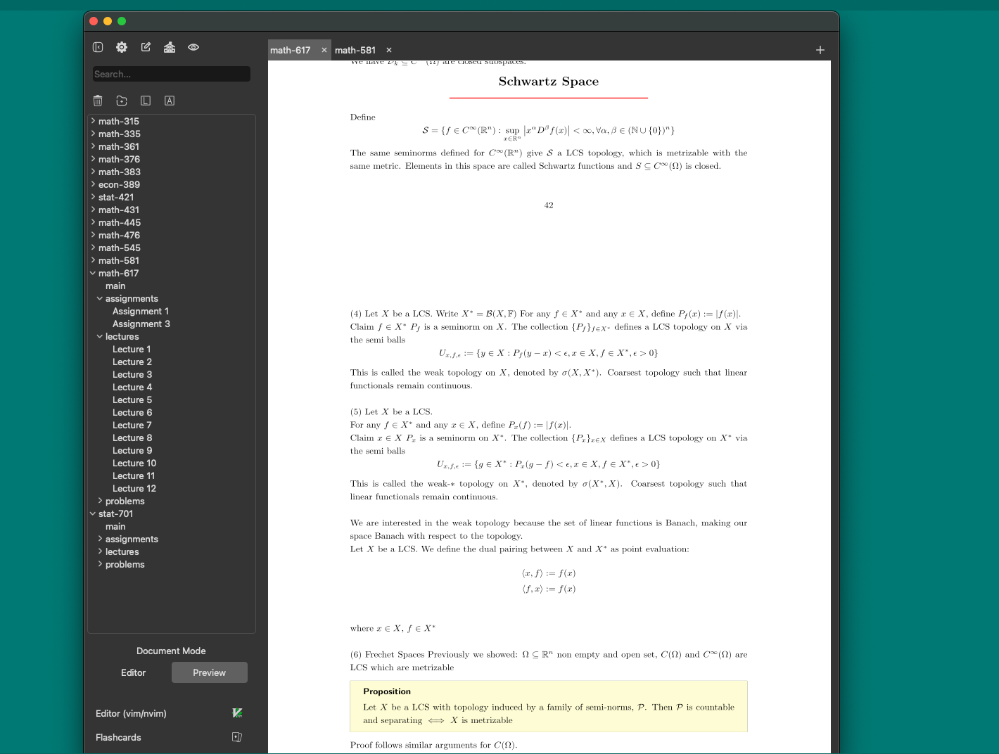
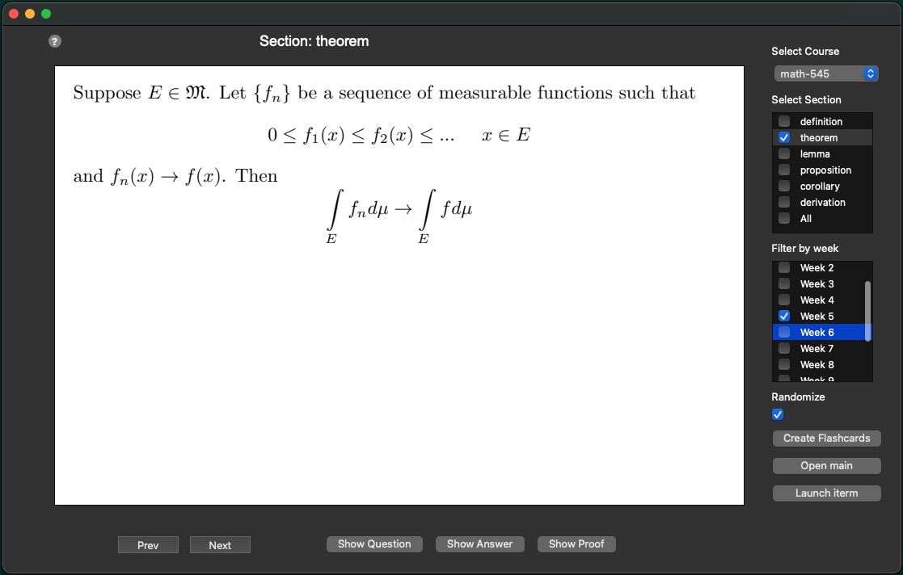

# MathNote



MathNote is a LaTeX/Typst note taking tool, used to:
1. Maintain course notes in a structured format
2. Automatically generate flashcards from course notes
3. Manage a collection of shorter notes
4. Preview Typst documents live via a graphical user interface

## Usage
`mathnote [-h] [--update-config] {course,flashcard,note} ...`

Flags:
* `-h`, `--help`: help message
* `--update-config`: Update macro.tex and preamble.tex files. If any macro or preamble files have been modified --this command must be
ran before changes take effect. See [templates](#templates)

The command line interface has three main subcommands:
1. `course`: command used for setting up the directory structure, getting course information, and other "housekeeping" tasks
2. `flashcard`: used to generate pdf flashcards, parsed from LaTeX files
3. `note`: used for creating, managing, and providing network analysis of short notes.
4. `view`: launch the graphical user interface

### Flashcard
Usage: 
* `mathnote flashcard [-flag]`

Flags:
* `-f`, `--file`: Load flashcards from file. Must provide full path as flag argument

The `flashcard` command requires lecture notes to follow fairly strict formatting. In order to generate flashcards
from a LaTeX file, all relevant definitions, theorems, and other sections, must be contained in their own
"namespace", having the syntax
```
\sectionName{ ... }{
latex code
}
```
where sectionName would be one of: "definition, "theorem", "proof", ect.
Additionally theorem/lemma/proposition flashcards, by default include the proof as a second answer on the flashcard.
Note that theorem/lemma/proposition section flashcards will only have a corresponding proof when directly followed by a proof section in the Tex file.
For example:
```
\theo{Pythagorean theorem}{
pythagonrean theorem statement
}
\pf{}{
pythagorean theorem proof
}
```
Any LaTeX file following the above syntactic rules can be parsed into flashcards -- my personal
approach has been to define a `\newtcbtheorem` environment for each section in the preamble. For example; suppose
you have defined the `\newtcbtheorem` section "Theorem". I would then include the following command in macros.tex
```tex
\newcommand{\theo}[2]{\begin{Theorem*}{#1}{}#2\end{Theorem*}}
```
This allows you to write theorems (or any section) using the syntactic rules defined earlier.
All sections must be specified in the configuration file, for more details look [configuration](#configuration). 

### Course
Usage:
* `course {course_name} [-flag]`

Arguments:
* {name}     Name of course, e.g math-445

Flags:
* `-n`, `--new-course`: Initializes new course directory for {course_name}, to automate initialization set `-u` flag
* `-i`, `--information`: Display class information for {course_name}
* `-u`, `--user-input`: Initializes course.json through user input
* `-o`, `--open-main`: Opens main.pdf file corresponding to course {course_name}
* `-a`, `--new-assignment`: Copy's assignment template to `{course_name}/assignments/{course_name}_A{number}.tex`, where {number} will be 
        i + 1, where i is the number of existing assignments.
* `-l`, `--new-lecture`: Creates new lecture file for {course_name}

When a new course is created, the following directories are created under `NewCourse`
```
root/
├── preamble.tex
├── macros.tex
│
└── NewCourse/              # New course directory
     ├── main/    
     │   ├── main.tex
     │   └── lectures/
     │
     ├── resources/         # external resources included in main.tex (e.g figure.svg)
     ├── assignments/       # default location for assingments when created using 'course' cmd
     ├── problems/          # location for problem sets, ect
     └──course_info.json    # course configuration and information

```

### Note
Usage:
* `mathnote note [-flags]`

Flags:
* `-h`, `--help`: Show help message
* `-rm REMOVE_NAME`: Remove note specified by REMOVE_NAME
* `-ls`, `--list-notes`: List all notes
* `-o OPEN_NOTE`, `--open-note OPEN_NOTE`: Open note specified by OPEN_NOTE
* `-c NOTE_NAME`, `--compile NOTE_NAME`: Compile note specified by NOTE_NAME
* `-p`, `--plot-network`: Proved network representation of notes
* `--rename RENAME_NOTE`: Rename note with name RENAME_NOTE
* `-t NOTE_NAME`, `--tag NOTE_NAME`: Add tag to note with name NOTE_NAME
* `--remove-tag NOTE_NAME`: Remove tag from note specified by NOTE_NAME
* `--exists NOTE_NAME`: Returns 1 if note exists, otherwise returns 0


## Installation
Before installing MathNote, ensure the following prerequisites are met:
1. Python: Ensure you have Python 3.7 of higher installed
2. Latex: Install a LaTex distribution. Examples include
    * Tex Live (cross-platform): [Download TeX Live](https://www.tug.org/texlive/)
    * MikeTex (Windows): [Download MikTeX](https://miktex.org/)
    * MacTex (macOS): [Download MacTex](https://www.tug.org/mactex/)

3. Latexmk: Most Latex distributions include `latexmk`. If not installed, install via your package manager

Installing MathNote

Method 1:
```
pip install git+https://github.com/Josh-T1/MathNote.git
```

Method 2:
1. Clone the repository and install
```
git clone https://github.com/Josh-T1/MathNote.git
pip install .
```

Verify installation:
```
mathnote --help
```

## Configuration
The configuration directory for MathNote is determined based on the operating system
* Windows: Located at %APPDATA%\MathNote, where %APPDATA% is the user's application data directory (e.g., C:\Users\<User>\AppData\Roaming\MathNote).
* Linux/macOS (POSIX): Located at ~/.config/MathNote, where ~ is the user's home directory (e.g., /home/<user>/.config/MathNote).


Projection configurations must be set in `{config directory}/MathNote/config.json`. 

- `root`: full path to directory containing notes. The program will create
   all courses under the root directory. If no path is specified the program will create the directory
   `MathNote` under the home directory

- `macro-name`: List of all user defined commands in macros.tex, with backslashed excluded.
  For example suppose we have defined the command
  ```tex
    \newcommand{\norm}[1]{\left\lVert#1\right\rVert}
  ```
  Then we would have
  ```json
   "macro-names": ["norm",...] 
  ```
- `section-names`: mapping between the section names and the shorthand versions used in tex files, 
    i.e [sectionName](#flashcard). For example one possible configuration would be
    ```json
    "section-names": {"DEFINITION": "defin", "THEOREM": "theo", "DERIVATION": "der",
    "PROOF": "pf", "COROLLARY": "corollary", "LEMMA": "lemma",
    "PROPOSITION": "proposition"},
    ```
    where `defin` is the section name used in the Tex file. Note that the sections in bold are the only available options, however
    it would not be very difficult to modify this behaviour yourself.

- `log-level`: "INFO": Logging level. Logs can be found at HOME/.config/MathNote/logs/
- `iterm2-enabled`: TODO
- `set-note-title`: "true" or "false", by default `note -n NEW_NOTE` adds the title NEW_NOTE to the Tex file. Setting 
to false disables this behaviour

Example config.json:
```
{  
        "root": "/Users/Name/MathNote",

        "section-names": {"DEFINITION": "defin", "THEOREM": "theo", "PROOF": "pf", "COROLLARY": "corollary",
          "LEMMA": "lemma", "PROPOSITION": "proposition"},

        "macro-names": ["mlim", "norm", "squarebk"],

        "log-level": "INFO",

        "iterm2-enabled": false,

        "set-note-title": true

}    

```
#### Templates
Under `{config directory}/MathNote/` you can specify the following optional template files (spelling must be exactly as specified):
1. `macros.tex`: The macro file used for course notes and assignments. Location for `\newcommand`
2. `preamble.tex`: The preamble file used for course notes and assignments. Must include all required packages and new environments, e.g "newtcbtheorem"
3. `macros.tex`: Macro file used for compiling notes
4. `preamble.tex`: The preamble used for compiling notes
After a new template has been added or edits have been made, you must run `mathnote --update-config` for the changes to take effect.

